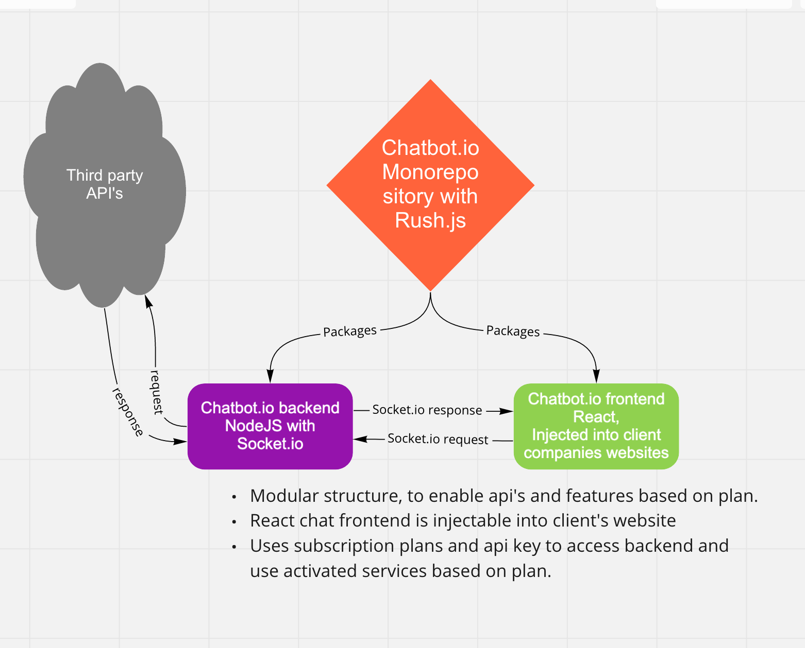

# GenioBot.io

## Runnig project

`rush update`

**Mac Users**

`rush start`

**Windows Users**

`rush start:windows`

## Build for production

`rush prettier`

First build:

`rush build`

All other times:

`rush rebuild`

Happy coding!!
